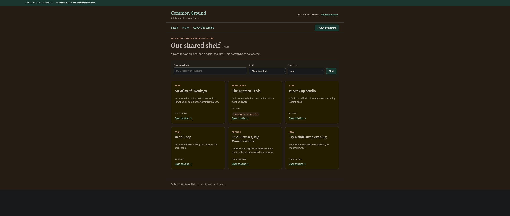

# Common Ground — local portfolio sample

A small, runnable engineering sample for saving ideas, finding them later, and making shared or personal plans. All people, places, books, articles, dates, notes, and preferences are invented for this sample.

**MIT-licensed portfolio sample. This repository is private; there is no hosted demo.**



## Run locally

Use Node.js 22 or newer. Validation used Node.js 25.8.1 on macOS. No npm dependencies, package installation, database, Docker, secrets, cloud account, or network service is needed.

```sh
npm test
npm run check
npm start
```

Open **http://127.0.0.1:4177**. Choose **Alex** or **Jamie**, with demo password **fictional-demo-only**. Both are fictional accounts available to any evaluator. This is an authorization demonstration, not a confidential service or a system to deploy publicly.

The server binds only to `127.0.0.1`, uses its own session cookie and fresh process-local signing key, and writes only to `.demo-data/` beside the sample. It does not read `.env`, cloud credentials, production configuration, or another application's data. Restarting invalidates demo sessions but preserves local sample records. Run only one process per sample directory. Stop with Ctrl+C.

For a fresh demo, stop the server and **move** `.demo-data/` to a separate local archive directory, then restart. Do not point the sample at other data. It rejects documents without its fictional-format marker. Do not enter personal content: the displayed demo credentials are public within the sample.

## Five-minute walkthrough

1. Log in as Alex. In Saved, search **Mossport**, choose **Places → Restaurants**. The Lantern Table appears even though its original outing is archived.
2. Open it. Read the invented notes, then choose **Start a plan**. Add Reed Loop and save a shared plan. Items are referenced, not duplicated.
3. Add a checklist step and a note. Open that same plan in a second tab. Save a change in the first tab; submit a different change from the stale second tab. The server rejects the stale version and its form retains the unsent text.
4. Switch to Jamie and reload any other open tabs. Plans shows shared plans and Jamie's personal plan; Alex's personal plan is absent. Use separate browser profiles if comparing both identities concurrently.
5. Save an invented idea. Try the preview stub first: it reports unavailable, but saving still works. Refresh to see that the record persisted.

See [architecture](docs/ARCHITECTURE.md), [validation and limits](docs/VALIDATION.md), [content provenance](docs/PROVENANCE.md), and [release review](docs/RELEASE-REVIEW.md).

## Contribution

I defined the product requirements and directed development using AI coding tools, which assisted with implementation, testing, and documentation. This portfolio sample uses fictional data to demonstrate shared planning, access controls, version-conflict handling, and persistence.

## Licence

Original code and demo content are licensed under [MIT](LICENSE). The bundled font retains its separate SIL Open Font License; see [third-party notices](THIRD-PARTY-NOTICES.md).

## What is reused

Selected domain modules implement search, visibility, strict plan validation, item references, independent note versions, request identifiers, authenticated session primitives, and serialized file persistence. The sample adapts fixed account keys to fictional accounts and removes personal destination preferences. A new local HTTP/UI harness exposes a bounded subset of those existing mechanisms. This is not the complete private application or its production frontend.

## What is not demonstrated

No live conversations, relational planning agreements, reservations, catalog imports, provider inference, Todoist task creation, job alerts, media handling, external notifications, deployment tooling, production migrations, or cloud backup/restore. Preview retrieval is a **local failure stub**. The file backend is single-process and does not offer a database transaction across its state and receipt files. See the documented failure window and tests.

Tests demonstrate specific software behavior with synthetic data. They do not establish adoption, time savings, independent security certification, production availability, or individual contribution percentages.
